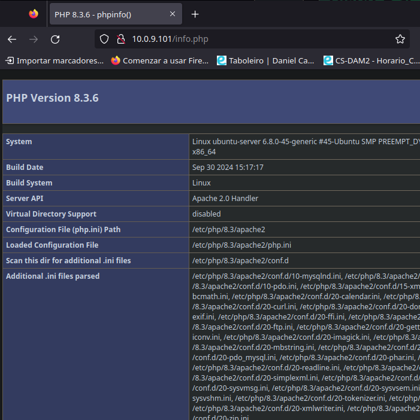

### Tarea 04
1. Utiliza la imagen de Ubuntu , tag 22 y apoyandote en esta [guía](https://www.itzgeek.com/how-tos/linux/ubuntu-how-tos/install-lamp-stack-apache-mariadb-php-on-ubuntu-22-04.html#Method_1_Install_LAMP_Stack_Manually_One_by_one) sigue sus instrucciones para instalar LAMP en dicho contenedor.
Instalar Apache
```sh
sudo apt update # actualizar lista de paquetes
sudo apt install -y apache2 apache2-utils # instalar apache
```
Instalar MariaDB
```sh
sudo apt install -y mariadb-server mariadb-client # instalar MariaDB
sudo mysql_secure_installation # configurar la instalacion de manera segura
```
Instalar PHP
```sh
sudo apt install -y php php-mysql libapache2-mod-php # instalar php
sudo systemctl restart apache2 # reiniciar el servicio apache2
```
Probar PHP
```sh
echo "<?php phpinfo(); ?>" | sudo tee /var/www/html/info.php # agregar fichero de prueba al directorio html default
```
Ahora probamos accediendo a la ip de nuestro servidor a traves de un navegador accediendo a la pagina `/info.php`

2. Utiliza esta [guía](https://ubuntu.com/tutorials/install-and-configure-wordpress#1-overview) para instalar wordpress en el contenedor.
Instalar dependencias
```sh
sudo apt install ghostscript \
                 libapache2-mod-php \
                 mysql-server \
                 php \
                 php-bcmath \
                 php-curl \
                 php-imagick \
                 php-intl \
                 php-json \
                 php-mbstring \
                 php-mysql \
                 php-xml \
                 php-zip

```
Crear estructura de carpetas, descargar y extraer wordpress
```sh
sudo mkdir -p /srv/www
sudo chown www-data: /srv/www
curl https://wordpress.org/latest.tar.gz | sudo -u www-data tar zx -C /srv/www
```
Crear el archivo `/etc/apache2/sites-available/wordpress.conf` con esta configuracion
```sh
<VirtualHost *:80>
    DocumentRoot /srv/www/wordpress
    <Directory /srv/www/wordpress>
        Options FollowSymLinks
        AllowOverride Limit Options FileInfo
        DirectoryIndex index.php
        Require all granted
    </Directory>
    <Directory /srv/www/wordpress/wp-content>
        Options FollowSymLinks
        Require all granted
    </Directory>
</VirtualHost>
```
Habilitar sitio wordpress
```sh
sudo a2ensite wordpress
sudo a2dissite 000-default # desactivar pagina default para que no sobreeescriba el postgres
sudo systemctl reload apache2 # recargar configuracion apache
```
3. Comprueba que puedes acceder a wordpress. 

